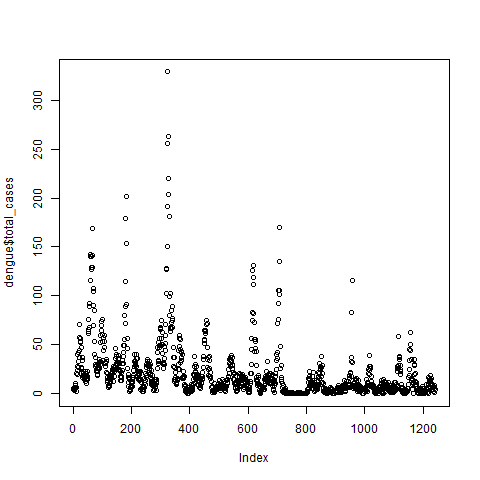
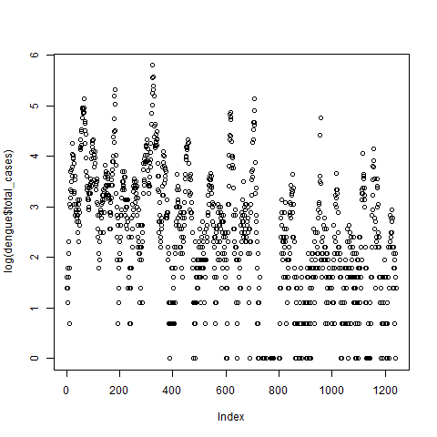
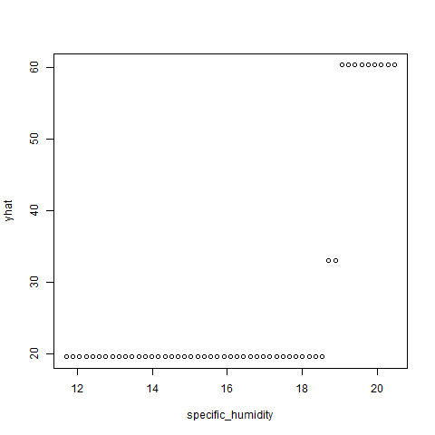
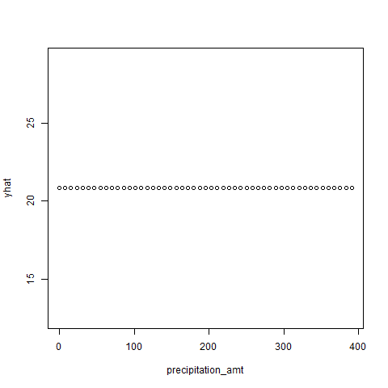
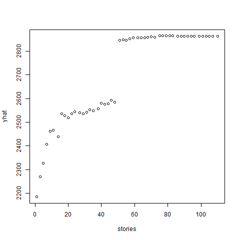

<!--   pdf_document: default
 md_document -->

```{r, include=FALSE,eval=FALSE}
options(tinytex.verbose = TRUE)
options(dplyr.summarise.inform = FALSE)
```

```{r setup, include=FALSE,eval=FALSE}
library(magrittr) # needs to be run every time you start R and want to use %>%
library(dplyr)    # alternarary(knitr)
library(tidyverse) 
library(sjmisc)
library(ggplot2)
library(reshape2)
library(gapminder)
library(mosaic)
library(extraDistr)
library(caret)
library(modelr)
library(parallel)
library(foreach)
library(rsample)
library(lubridate)
library(olsrr)
library(rpart)
library(rpart.plot)
library(randomForest)
library(gbm)
library(gamlr)
```


# 2) Tree modeling:dengue cases

## 1. Overview
- Our goal is to use CART, random forests, and gradient-boosted trees to predict dengue cases

## 2. Data and Model

### 2-1 Data
- dengue.csv
- The detailed explanations of each variables are in the prompt

### 2-2 Model

We took CART, random forests, and gradient-boosted trees to predict dengue cases as follow:

$$
\begin{aligned}
total\ cases = city + season + specific\ humidity+tdtr\ k+precipitation\ amt
\end{aligned}
$$

Note: we did not take log for total cases because we thought total cases did not look like it had any trend term as follow:
```{r , echo=FALSE,fig.width =5.5, fig.height = 2,fig.align='center',eval=FALSE,}
png("./fig/totalcase.png")
plot(dengue$total_cases)
dev.off()
png("./fig/logtotalcase.png")
plot(log(dengue$total_cases))
dev.off()
```

```{r, echo=FALSE,out.width ="40%", out.height = "40%",fig.align='center',fig.show="hold"}


```
Note: the left side shows the total case and right side does the logarithm of the the total case.

## 3. Results and Conclusion

```{r , echo=FALSE,fig.width =5.5, fig.height = 2,fig.align='center',eval=FALSE}
dengue <- read.csv('dengue.csv')
dengue = dengue %>% drop_na()
dengue$city = factor(dengue$city)
dengue$season = factor(dengue$season)

K_folds = 5
dengue_folds = crossv_kfold(dengue, k=K_folds)

cart_cv = map(dengue_folds$train, ~ rpart(total_cases ~ city + season + specific_humidity+tdtr_k+precipitation_amt, data=.))
forest_cv = map(dengue_folds$train,~randomForest(total_cases ~ city + season + specific_humidity+tdtr_k+precipitation_amt,data=.))
boost_cv = map(dengue_folds$train,~gbm(total_cases ~ city + season + specific_humidity+tdtr_k+precipitation_amt, 
               data = ., interaction.depth=4, n.trees=500, shrinkage=.05))

rmse_cart_cv = mean(map2_dbl(cart_cv, dengue_folds$train, modelr::rmse))
rmse_forest_cv = mean(map2_dbl(forest_cv, dengue_folds$train, modelr::rmse))
rmse_boost_cv = mean(map2_dbl(boost_cv, dengue_folds$train, modelr::rmse))
#c(rmse_cart_cv, rmse_forest_cv, rmse_boost_cv)
```

From the result, these rmse of there models are
```{r , echo=FALSE,fig.width =5.5, fig.height = 2,fig.align='center'}
knitr::kable(cbind(cart=24.56930,forest=22.40354, boost=18.50443))
```

Therefore, the best model to predict dengue cases in this analysis is the gradient-boosted trees.

Also, three partial dependence plots on specific_humidity, precipitation_amt and city in the boost model are 
```{r , echo=FALSE,fig.width =5.5, fig.height = 2,fig.align='center',eval=FALSE}
boost = gbm(total_cases ~ city + season + specific_humidity+tdtr_k+precipitation_amt,data = dengue, interaction.depth=4, n.trees=500, shrinkage=.05)
p1 = pdp::partial(cart, pred.var = 'specific_humidity')
p2= pdp::partial(cart, pred.var = 'precipitation_amt')
p3 = pdp::partial(cart, pred.var = 'city')

png("./fig/specific_humidity.png")
plot(p1)
dev.off()
png("./fig/precipitation_amt.png")
plot(p2)
dev.off()
png("./fig/city.png")
plot(p3)
dev.off()

### Or if we use the boost, we can get the graph directly from the plot
```

```{r, echo=FALSE,out.width ="30%", out.height = "50%",fig.align='center',fig.show="hold"}


knitr::include_graphics("./fig/city.png")
```

From these graphs, we can get some interpretations in the following: 
- If average specific humidity(specific_humidity) is over about 19, total cases will increase by 40
- Rainfall for the week in millimeters does not relate to the total cases
- the avereage cases in the San Juan will be larger than in Iquitos, Peru by about 30


\newpage

# 3) Predictive model building: green certification

## 1. Overview

- Our goal is to build the best predictive model possible for revenue per square foot per calendar year

* "revenue per square foot per calendar year" is the product of rent and leasing_rate in the data

## 2. Data and Model

### 2-1 Data
- Green buildings in greenbuildings.csv (7894 commercial rental properties from across United States)
- Of these, 685 properties have been awarded either LEED or EnergyStar certification as a green building
- The detailed explanations of each variables are in the prompt
-  "revenue per square foot per claendar year"(RPS), which will be dependent variable, is the product of rent and leasing_rate in the data.
- Excluded CS.PropertyID from the data because it has no meaning for this analysis

### 2-2 Model

We took 2 steps to get the best predictive model as follow:

### 2-2-1 Model Selection

At first, we did the stepwise selection and the Lasso regression to find independent variables that we should include the model. After we got both results, we compared two rmses and decided to include variables that has the lower rmse.

Note: Because of the limitation of the time(step wise selection are required to take a lot of time), we did not use cross validation to improve the quality of our analysis. And we considered LEED and EnergyStar separately thorough this analysis.


### 2-2-2 Compared Regressions and Trees

After we decided to use dependent variables in this model, we compared models of the "linear regression" and "Knn regression" and the  models of the "CART", "Random Forest" and "Boost" from the perspective of the RMSE with K-CV(10 folds).

Note: in Tree models, we did not specify dependent variables like linear and knn regression, because they automatically consider interaction terms.

### 2-2-3 Partial Dependence(Additional)
We also got some partial dependences of the model that had the lowest rmse in our models from 2-2-2 to interpret our model.

## 3. Results

### 3-1 Model Selection

```{r , echo=FALSE,fig.width =5.5, fig.height = 2,fig.align='center',eval=FALSE}
greenbuildings <- read.csv('greenbuildings.csv')
greenbuildings = greenbuildings %>% drop_na()
greenbuildings=greenbuildings %>% mutate(rps=Rent*leasing_rate)
greenbuildings$green_rating <- NULL
greenbuildings$Rent <- NULL
greenbuildings$leasing_rate <- NULL

data <- as.data.frame(greenbuildings[2:21])

### feature engineering

#### stepwise selection
lm_medium = lm(rps ~ ., data=data)
lm_step = step(lm_medium, scope=~(.)^2)
predicted_step=predict(lm_step,data)
rmse_step = sqrt(mean((data$rps - predicted_step)^2))

### Lasso
scx=model.matrix(rps ~ .-1, data=data)
scy = data$rps
sclasso = gamlr(scx, scy, family="poisson")
predicted_lasso= predict(sclasso,scx)
rmse_lasso = sqrt(mean((data$rps - predicted_lasso)^2))

#c(step=rmse_step, lasso=rmse_lasso)
```

From the result, rmses of the stepwise and lasso are
```{r , echo=FALSE,fig.width =5.5, fig.height = 2,fig.align='center'}
knitr::kable(cbind(step=991.152,lasso=2861.317))
```

Therefore, we decided to use dependent variables according to the stepwise as follow:

$$
\begin{aligned}
RPS&=\beta_0+\beta(cluster + size +  empl_gr + stories + age +renovated + class_a + class_b  \\
&+ LEED+Energystar+net +amenities+ cd_total_07 +hd_total07 +Precipitation+Gas_Costs \\
&+Electricity_Costs +City_Market_Rent +size \times City_Market_Rent+cluster \times size\\
& +cluster \times City_Market \ Rent +stories \times class \ a +size \times Precipitation \\
& +amenities \times Gas \ Costs + empl \ gr \times Electricity \ Costs +stories \times Gas \ Costs\\
&+age \times City \ Market \ Rent+age \times Electricity \ Costs+renovated \times Precipitation \\
&+ renovated \times City \ Market \ Rent+renovated \times Gas \ Costs+size \times class \ b\\
&+ size \times class \ a+ size \times age+age \times class \ a\\
&+Electricity \ Costs \times City \ Market \ Rent+renovated \times hd \ total07\\
&+cluster \times Precipitation+class \ a \times Gas \ Costs +class \ b \times LEED\\
&+size \times hd \ total07 +hd \ total07 \times Precipitation + cd \ total \ 07 \times Precipitation\\
& +Precipitation \times City \ Market \ Rent +Gas \ Costs \times City \ Market \ Rent \\
& +class \ a \times hd \ total07 +class \ a \times Electricity \ Costs+ size \times Electricity \ Costs\\
& +empl \ gr \times renovated+ stories \times renovated+size \times renovated\\
& +class \ a \times Precipitation +cluster \times Electricity \ Costs +cluster \times hd \ total07 \\
& +cluster \times stories+size \times stories +stories \times age)
\end{aligned}
$$

### 3-2 Comparison

```{r , echo=FALSE,fig.width =5.5, fig.height = 2,fig.align='center',eval=FALSE}
### Comparison(linear, knn, CART,Forest, Boost)
K_folds = 5
gb_folds = crossv_kfold(data, k=K_folds)

#### Scaling
scale = apply(data, 2, sd)
data_tilde = scale(data , scale = scale) %>% as.data.frame
data_tilde$rps <- NULL
data_cv <- as.data.frame(cbind(data$rps, data_tilde))
names(data_cv)[names(data_cv)=="data$rps"] <- "rps"

#### Linear regression

model_lm_cv = map(gb_folds$train, ~ lm(rps ~ cluster + size +  empl_gr + stories + age +renovated + class_a + class_b  + LEED+Energystar+net +amenities+ cd_total_07 +hd_total07 +Precipitation+Gas_Costs +Electricity_Costs +City_Market_Rent +size:City_Market_Rent+cluster:size+cluster:City_Market_Rent +stories:class_a +size:Precipitation +amenities:Gas_Costs + empl_gr:Electricity_Costs +stories:Gas_Costs+age:City_Market_Rent+age:Electricity_Costs+renovated:Precipitation + renovated:City_Market_Rent+renovated:Gas_Costs+size:class_b+ size:class_a+ size:age+age:class_a+Electricity_Costs:City_Market_Rent+renovated:hd_total07+cluster:Precipitation+class_a:Gas_Costs +class_b:LEED+size:hd_total07 +hd_total07:Precipitation + cd_total_07:Precipitation+Precipitation:City_Market_Rent +Gas_Costs:City_Market_Rent +class_a:hd_total07 +class_a:Electricity_Costs+ size:Electricity_Costs+empl_gr:renovated+ stories:renovated+size:renovated+class_a:Precipitation +cluster:Electricity_Costs +cluster:hd_total07 +cluster:stories+size:stories +stories:age ,data=.))
rmse_lm_cv = mean(map2_dbl(model_lm_cv, gb_folds$test, modelr::rmse))

#### KNN regression
model_knncv = foreach(k = 1:200, .combine='rbind') %do% {
  models1 = map(gb_folds$train, ~ knnreg(rps ~ cluster + size +  empl_gr + stories + age +renovated + class_a + class_b  + LEED+Energystar+net +amenities+ cd_total_07 +hd_total07 +Precipitation+Gas_Costs +Electricity_Costs +City_Market_Rent +size:City_Market_Rent+cluster:size+cluster:City_Market_Rent +stories:class_a +size:Precipitation +amenities:Gas_Costs + empl_gr:Electricity_Costs +stories:Gas_Costs+age:City_Market_Rent+age:Electricity_Costs+renovated:Precipitation + renovated:City_Market_Rent+renovated:Gas_Costs+size:class_b+ size:class_a+ size:age+age:class_a+Electricity_Costs:City_Market_Rent+renovated:hd_total07+cluster:Precipitation+class_a:Gas_Costs +class_b:LEED+size:hd_total07 +hd_total07:Precipitation + cd_total_07:Precipitation+Precipitation:City_Market_Rent +Gas_Costs:City_Market_Rent +class_a:hd_total07 +class_a:Electricity_Costs+ size:Electricity_Costs+empl_gr:renovated+ stories:renovated+size:renovated+class_a:Precipitation +cluster:Electricity_Costs +cluster:hd_total07 +cluster:stories+size:stories +stories:age, k=k, data = ., use.all=FALSE))
  errs1 = map2_dbl(models1, gb_folds$test, modelr::rmse)
  c(k=k, err = mean(errs1), std_err = sd(errs1)/sqrt(K_folds))
} %>% as.data.frame

knn_min_rmse=model_knncv[model_knncv$err==min(model_knncv$err),]

#### CART
cart_cv = map(gb_folds$train, ~ rpart(rps ~ ., data=.,control = rpart.control(cp = 0.002, minsplit=30)))
rmse_cart_cv = mean(map2_dbl(cart_cv, gb_folds$train, modelr::rmse))

#### Forest
forest_cv = map(gb_folds$train,~randomForest(rps ~ .,data=.))
rmse_forest_cv = mean(map2_dbl(forest_cv, gb_folds$train, modelr::rmse))

#### Boost
boost_cv = map(gb_folds$train,~gbm(rps ~ ., data = ., interaction.depth=4, n.trees=500, shrinkage=.05))
rmse_boost_cv = mean(map2_dbl(boost_cv, gb_folds$train, modelr::rmse))

#c(rmse_lm_cv,knn_min_rmse$err,rmse_cart_cv,rmse_forest_cv,rmse_boost_cv)
```

From the results, we got the rmse of the linear, knn, CART, Forest, Boost, which are

```{r , echo=FALSE,fig.width =5.5, fig.height = 2,fig.align='center'}
knitr::kable(cbind(Lm=1006.3655,Knn=1375.1760,CART=940.1157,Forest=414.1079,Boost=817.5708))
```

Therefore, Forest model had the lowest rmse in this analysis.

### 3-3 Partial Dependence(Additional)

We got some partial dependences of the random forest model that had the lowest rmse to interpret our model.

```{r , echo=FALSE,fig.width =5.5, fig.height = 2,fig.align='center',eval=FALSE}
forest = randomForest(rps ~ .,data=data)
p1 = pdp::partial(forest, pred.var = 'size', n.trees=350)
p2= pdp::partial(forest, pred.var = 'stories', n.trees=350)
p3 = pdp::partial(forest, pred.var = 'age', n.trees=350)
p4 = pdp::partial(forest, pred.var = 'LEED', n.trees=350)
p5 = pdp::partial(forest, pred.var = 'Energystar', n.trees=350)
p6 = pdp::partial(forest, pred.var = 'Precipitation', n.trees=350)
p7 = pdp::partial(forest, pred.var = 'Gas_Costs', n.trees=350)
p8 = pdp::partial(forest, pred.var = 'Electricity_Costs', n.trees=350)

#png("./fig/size.png")
#plot(p1)
#dev.off()
#png("./fig/stories.png")
#plot(p2)
#dev.off()
#png("./fig/age.png")
#plot(p3)
#dev.off()
#png("./fig/LEED.png")
#plot(p4)
#dev.off()
#png("./fig/Energystar.png")
#plot(p5)
#dev.off()
#png("./fig/Precipitation.png")
#plot(p6)
#dev.off()
#png("./fig/Gas_Costs.png")
#plot(p7)
#dev.off()
#png("./fig/Electricity_Costs.png")
#plot(p8)
#dev.off()
```

```{r, echo=FALSE,out.width ="30%", out.height = "70%",fig.align='center',fig.show="hold"}
knitr::include_graphics("./fig/size.png")

knitr::include_graphics("./fig/age.png")
knitr::include_graphics("./fig/LEED.png")
knitr::include_graphics("./fig/Energystar.png")
knitr::include_graphics("./fig/Precipitation.png")
knitr::include_graphics("./fig/Gas_Costs.png")
knitr::include_graphics("./fig/Electricity_Costs.png")
```

## Conclusion

In our analysis, the forest model was the best predictive model, which means it had the lowest rmse in models(linear, knn, CART, random forest, boost).

From the partial dependence of the forest model, revenue per square foot per year(RPS) will goes up if its size, stories, gas costs and electronic costs. Also, if a building had LEED and Energy star, RPS will increase but its magnitude of LEED (over 2550)is larger that that of Energystar (under 2450) from graphs. The age and precipitation make RPS lower, but it looks like not going to do that if it goes over thresholds.


## Appendix

The optimal coefficients in the stepwise function
```{r, echo=FALSE,out.width ="50%", out.height = "50%",fig.align='center',fig.show="hold"}
knitr::include_graphics(c("./fig/table.png"))
```
