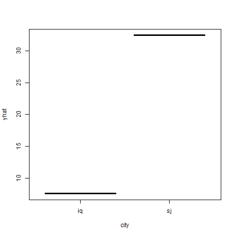
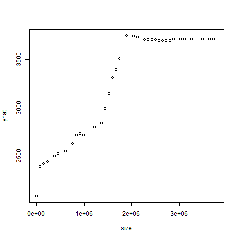
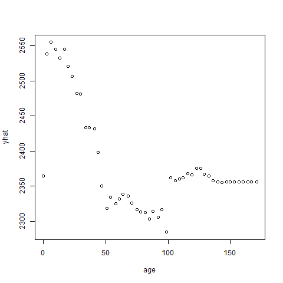
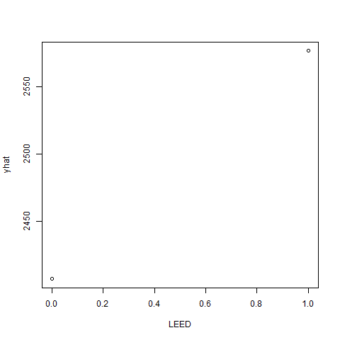
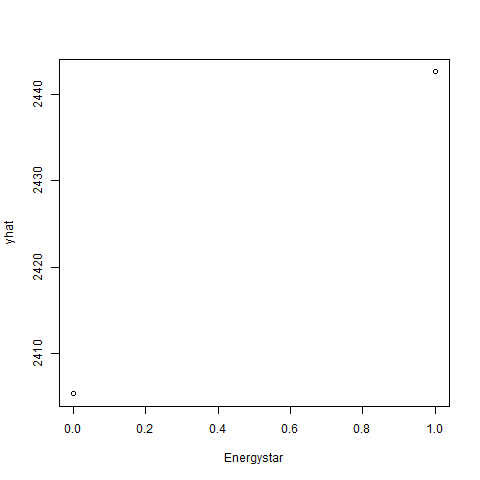
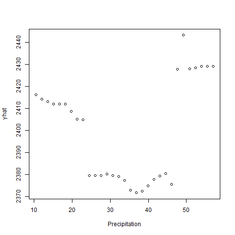
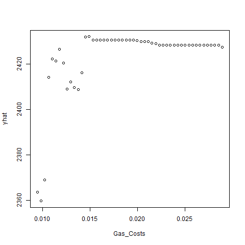
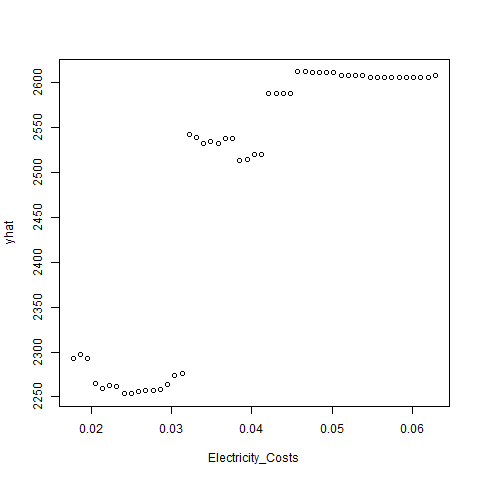

<!--   pdf_document: default
 md_document -->

# 2) Tree modeling:dengue cases

## 1. Overview

-   Our goal is to use CART, random forests, and gradient-boosted trees
    to predict dengue cases

## 2. Data and Model

### 2-1 Data

-   dengue.csv
-   The detailed explanations of each variables are in the prompt

### 2-2 Model

We took CART, random forests, and gradient-boosted trees to predict
dengue cases as follow:

$$
\begin{aligned}
total\\ cases = city + season + specific\\ humidity+tdtr\\ k+precipitation\\ amt
\end{aligned}
$$

Note: we did not take log for total cases because we thought total cases
did not look like it had any trend term as follow:

Note: the left side shows the total case and right side does the
logarithm of the the total case.

## 3. Results and Conclusion

From the result, these rmse of there models are

<table>
<thead>
<tr class="header">
<th style="text-align: right;">cart</th>
<th style="text-align: right;">forest</th>
<th style="text-align: right;">boost</th>
</tr>
</thead>
<tbody>
<tr class="odd">
<td style="text-align: right;">24.5693</td>
<td style="text-align: right;">22.40354</td>
<td style="text-align: right;">18.50443</td>
</tr>
</tbody>
</table>

Therefore, the best model to predict dengue cases in this analysis is
the gradient-boosted trees.

Also, three partial dependence plots on specific\_humidity,
precipitation\_amt and city in the boost model are

From these graphs, we can get some interpretations in the following: -
If average specific humidity(specific\_humidity) is over about 19, total
cases will increase by 40 - Rainfall for the week in millimeters does
not relate to the total cases - the avereage cases in the San Juan will
be larger than in Iquitos, Peru by about 30

# 3) Predictive model building: green certification

## 1. Overview

-   Our goal is to build the best predictive model possible for revenue
    per square foot per calendar year

-   “revenue per square foot per calendar year” is the product of rent
    and leasing\_rate in the data

## 2. Data and Model

### 2-1 Data

-   Green buildings in greenbuildings.csv (7894 commercial rental
    properties from across United States)
-   Of these, 685 properties have been awarded either LEED or EnergyStar
    certification as a green building
-   The detailed explanations of each variables are in the prompt
-   “revenue per square foot per claendar year”(RPS), which will be
    dependent variable, is the product of rent and leasing\_rate in the
    data.
-   Excluded CS.PropertyID from the data because it has no meaning for
    this analysis

### 2-2 Model

We took 2 steps to get the best predictive model as follow:

### 2-2-1 Model Selection

At first, we did the stepwise selection and the Lasso regression to find
independent variables that we should include the model. After we got
both results, we compared two rmses and decided to include variables
that has the lower rmse.

Note: Because of the limitation of the time(step wise selection are
required to take a lot of time), we did not use cross validation to
improve the quality of our analysis. And we considered LEED and
EnergyStar separately thorough this analysis.

### 2-2-2 Compared Regressions and Trees

After we decided to use dependent variables in this model, we compared
models of the “linear regression” and “Knn regression” and the models of
the “CART”, “Random Forest” and “Boost” from the perspective of the RMSE
with K-CV(10 folds).

Note: in Tree models, we did not specify dependent variables like linear
and knn regression, because they automatically consider interaction
terms.

### 2-2-3 Partial Dependence(Additional)

We also got some partial dependences of the model that had the lowest
rmse in our models from 2-2-2 to interpret our model.

## 3. Results

### 3-1 Model Selection

From the result, rmses of the stepwise and lasso are

<table>
<thead>
<tr class="header">
<th style="text-align: right;">step</th>
<th style="text-align: right;">lasso</th>
</tr>
</thead>
<tbody>
<tr class="odd">
<td style="text-align: right;">991.152</td>
<td style="text-align: right;">2861.317</td>
</tr>
</tbody>
</table>

Therefore, we decided to use dependent variables according to the
stepwise as follow:

$$
\begin{aligned}
RPS&=\beta\_0+\beta(cluster + size +  empl\_gr + stories + age +renovated + class\_a + class\_b  \\\\
&+ LEED+Energystar+net +amenities+ cd\_total\_07 +hd\_total07 +Precipitation+Gas\_Costs \\\\
&+Electricity\_Costs +City\_Market\_Rent +size \times City\_Market\_Rent+cluster \times size\\\\
& +cluster \times City\_Market \\ Rent +stories \times class \\ a +size \times Precipitation \\\\
& +amenities \times Gas \\ Costs + empl \\ gr \times Electricity \\ Costs +stories \times Gas \\ Costs\\\\
&+age \times City \\ Market \\ Rent+age \times Electricity \\ Costs+renovated \times Precipitation \\\\
&+ renovated \times City \\ Market \\ Rent+renovated \times Gas \\ Costs+size \times class \\ b\\\\
&+ size \times class \\ a+ size \times age+age \times class \\ a\\\\
&+Electricity \\ Costs \times City \\ Market \\ Rent+renovated \times hd \\ total07\\\\
&+cluster \times Precipitation+class \\ a \times Gas \\ Costs +class \\ b \times LEED\\\\
&+size \times hd \\ total07 +hd \\ total07 \times Precipitation + cd \\ total \\ 07 \times Precipitation\\\\
& +Precipitation \times City \\ Market \\ Rent +Gas \\ Costs \times City \\ Market \\ Rent \\\\
& +class \\ a \times hd \\ total07 +class \\ a \times Electricity \\ Costs+ size \times Electricity \\ Costs\\\\
& +empl \\ gr \times renovated+ stories \times renovated+size \times renovated\\\\
& +class \\ a \times Precipitation +cluster \times Electricity \\ Costs +cluster \times hd \\ total07 \\\\
& +cluster \times stories+size \times stories +stories \times age)
\end{aligned}
$$

### 3-2 Comparison

From the results, we got the rmse of the linear, knn, CART, Forest,
Boost, which are

<table>
<thead>
<tr class="header">
<th style="text-align: right;">Lm</th>
<th style="text-align: right;">Knn</th>
<th style="text-align: right;">CART</th>
<th style="text-align: right;">Forest</th>
<th style="text-align: right;">Boost</th>
</tr>
</thead>
<tbody>
<tr class="odd">
<td style="text-align: right;">1006.365</td>
<td style="text-align: right;">1375.176</td>
<td style="text-align: right;">940.1157</td>
<td style="text-align: right;">414.1079</td>
<td style="text-align: right;">817.5708</td>
</tr>
</tbody>
</table>

Therefore, Forest model had the lowest rmse in this analysis.

### 3-3 Partial Dependence(Additional)

We got some partial dependences of the random forest model that had the
lowest rmse to interpret our model.

## Conclusion

In our analysis, the forest model was the best predictive model, which
means it had the lowest rmse in models(linear, knn, CART, random forest,
boost).

From the partial dependence of the forest model, revenue per square foot
per year(RPS) will goes up if its size, stories, gas costs and
electronic costs. Also, if a building had LEED and Energy star, RPS will
increase but its magnitude of LEED (over 2550)is larger that that of
Energystar (under 2450) from graphs. The age and precipitation make RPS
lower, but it looks like not going to do that if it goes over
thresholds.

## Appendix

The optimal coefficients in the stepwise function

